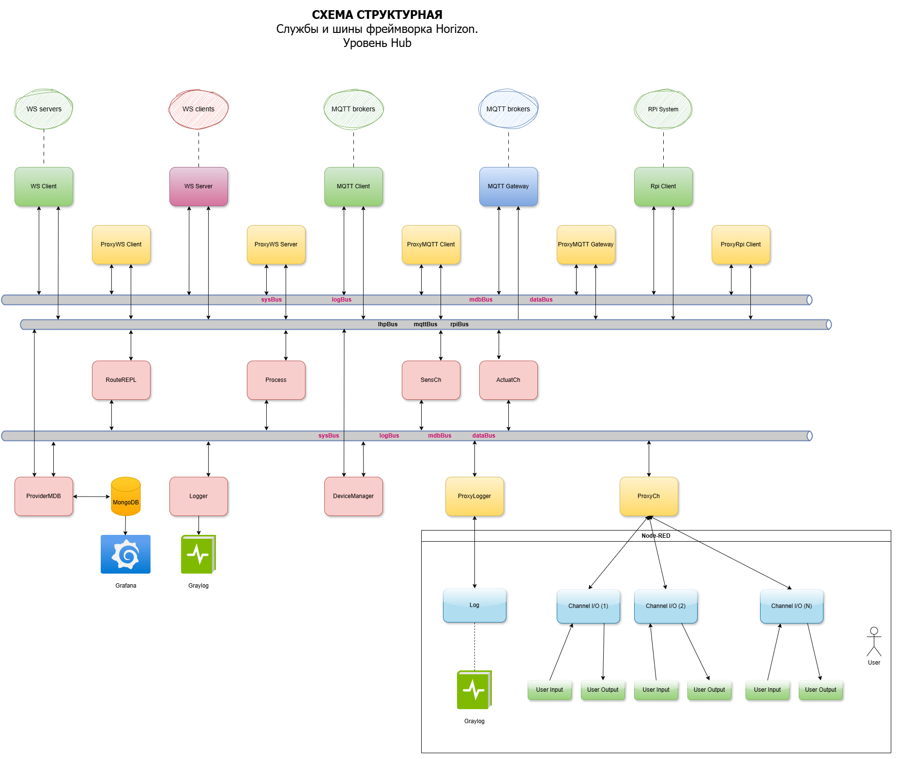
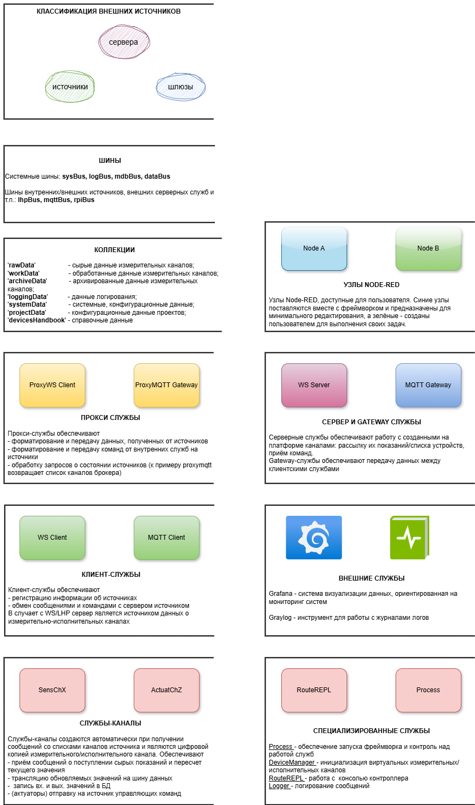
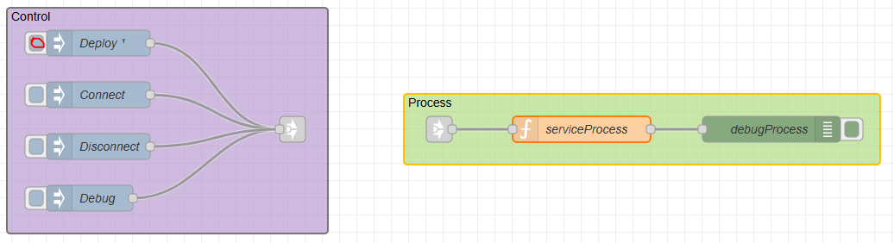
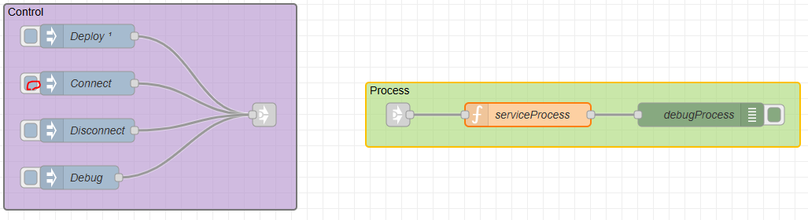

<div style = "font-family: 'Open Sans', sans-serif; font-size: 16px">

# HorizonServer
<p align="center">
  
</p>

-----------------

# Лицензия
////

## Описание
<div style = "color: #555">

Данный документ является общим описанием функционирования серверной части Horizon Automation. Для более полного описания следует обратиться к документациям всех составных модулей системы. Структура Horizon Server представляет из себя несколько программных модулей (служб), запускаемых в определённом порядке, базы данных, в которой хранится конфигурации фреймворка, и Node-RED, являющимся пространством для разворачивания потоков и управления фреймворком. Службы деляться на обязательные (primary), без которых фреймворк не будет функционировать, и опциональных (auxilary), в основном выполняющих функции соединения и работы с PLC фреймворка.
Обязательные службы:
- <mark style="background-color: lightblue">Process</mark> - основная служба - запускается первой и отвечает за запуск и конфигурацию остальных служб, как основных, так и опциональных;
- <mark style="background-color: lightblue">ProviderMDB</mark> - обеспечивает взаимодействие с базой данных, по запросу Process возвращает конфигурации фреймворка;
- <mark style="background-color: lightblue">Logger</mark> - выполняет логирование сообщений всей системы в Graylog;
- <mark style="background-color: lightblue">ProxyLogger</mark> - осуществляет взаимодействие между службой Logger и Userspace, в случае если пользователь захочет логировать сообщение из Node-RED;
- <mark style="background-color: lightblue">DeviceManager</mark> - служба занимается мониторингом всех каналов, их состоянии, а также их регистрации в системе через прокси-службы работы с источниками;
- <mark style="background-color: lightblue">ProxyChannel</mark> - служба работает посредником между фреймворком и userspace, передаёт на выбранные пользователем узлы Node-RED информацию с указанных пользователем-же каналов.
Опциональные службы:
- <mark style="background-color: lightblue">WSClient</mark> - обеспечивает взаимодействие с PLC по протоколу websocket;
- <mark style="background-color: lightblue">ProxyWSClient</mark> - прокси-служба для WSClient;
- <mark style="background-color: lightblue">MQTTclient</mark> - обеспечивает взаимодействие с PLC по протоколу MQTT;
- <mark style="background-color: lightblue">ProxyMQTTclient</mark> - прокси-служба для MQTTclient;
- <mark style="background-color: lightblue">RPIclient</mark> - обеспечивает взаимодействие с PLC по протоколу RPI;
- <mark style="background-color: lightblue">ProxyPRIlient</mark> - прокси-служба для RPIclient;
- <mark style="background-color: lightblue">MQTTGw</mark> - служба реализует ;
- <mark style="background-color: lightblue">ProxyMQTTGw</mark> - прокси-служба для RPIclient.

Службы для обмена сообщениями используют софтверные шины, каждая из которых предназначена для сообщений определённого типа. Как и службы, шины являются основными и второстепенными. Шины создаются службой Process.
Основные шины:
- <mark style="background-color: lightblue">sysBus</mark> - основная шина, используется для передачи системных сообщений;
- <mark style="background-color: lightblue">logBus</mark> - шина для передачи сообщений для логгера;
- <mark style="background-color: lightblue">mdbBus</mark> - шина для передачи сообщений и структур из и в базы данных;
- <mark style="background-color: lightblue">dataBus</mark> - шина для передачи информации виртуальных каналов.

Второстепенные шины:
- <mark style="background-color: lightblue">lhpBus</mark> - шина для передачи сообщений в формате пакета lhp, работает в связке со службами WSClient/ProxyWSClient;
- <mark style="background-color: lightblue">rpiBus</mark> - шина для передачи сообщений по RPI, работает в связке со службами RPIClient/ProxyRPIClient;
- <mark style="background-color: lightblue">mqttBus</mark> - шина для передачи сообщений mqtt, работает в связке со службами MQTTClient/ProxyMQTTClient;
- <mark style="background-color: lightblue">mqttGwBus</mark> - шина для работы с MQTT-брокером.

<p align="center">
  
  <p style="text-align: center;">Рисунок 1 - Структурная схема фреймворка</p>
</p>
<p align="center">
  
  <p style="text-align: center;">Рисунок 2 - Легенда структурной схемы фреймворка</p>
</p>

Также в Horizon Server присутствуют технические программные модули, которые либо не являются службами, либо реализуют интерфейс, но являются не менее важными:
- <mark style="background-color: lightblue">srvBus</mark> - модуль, расширяющий возможности класса EventEmitter2, используется для передачи сообщений по событиям. Все шины фреймворка являются объектами этого класса;
- <mark style="background-color: lightblue">srvBusMsg</mark> - модуль, задача которого является форматирование сообщения. Объекты этого класса передаются по шине;
- <mark style="background-color: lightblue">srvUtils/GenerateHash</mark> - модуль, реализующий хеш-функции, используется классом srvBusMsg;
- <mark style="background-color: lightblue">srvService</mark> - модуль реализует класс, от которого наследуются все службы фреймворка. Реализует базовые методы, такие как подключение к указанным шинам и подписка на события, запись в логгер, объявляются основные поля;
- <mark style="background-color: lightblue">srvSensorChannel</mark> - модуль реализует виртуальный образ канала, связанный с реальным. Объекты этого класса создаются службой DeviceManager и являются источником данных на серверной стороне фреймворка.
</div>

## Инициализация системы
<div style = "color: #555">

Инициализация системы начинается с разворачивания потока Node-RED. Далее в ход вступает следующий алгоритм:
1) Через 0.1 секунду срабатывает Inject, запускающий узел, в котором происходит запуск службы Process;
<p align="center">
  
  <p style="text-align: center;">Рисунок 3 - Узлы Node-RED, в которых происходит инициализация всего фреймворка</p>  
</p>

2) В узле создаётся пустой объект FlowBusList. Этот объект будет заполнен службой Process необходимыми шинами;
3) Создаётся объект службы Process, в конструктор которого передаётся пустой объект FlowBusList и объект узла Node-RED;
```js
{   // Создание объекта Process
    const FlowBusList = {};
    const ClassProcess = global.get('ClassProcess_S');
    const Process = new ClassProcess({_busList: FlowBusList, _node: node});
    flow.set('FlowBusList', FlowBusList);
    flow.set('process', Process);
    global.set('GlobalBusList', { 
        dataBus: FlowBusList.dataBus, 
        logBus: FlowBusList.logBus 
    });
    global.set('proxyLogger', Process._ServicesState['proxylogger'].Service);
    global.set('proxyCh', Process._ServicesState['proxychannel'].Service);
}
```
4) Инициализируются поля класса: 
    - _GBusList принимает ссылку на FlowBusList;
    - _Node принимает ссылку на узел Node-RED;
    - _SourcesState - пустой объект, будет содержать информацию об источниках;
    - _ServicesState - пустой объект, будет содержать информацию о службах HorizonServer;
5) В конце конструктора вызывается метод Init();
6) Создаются основные шины системы, являющимися объектами вышеописанного модуля srvBus:
    - sysBus;
    - mdbBus;
    - dataBus;
    - logBus.
7) Созданные шины автоматически помещаются в объект _GBusList, являющийся полем службы Process;
8) Создаются объекты обязательных (primary) служб (см. список выше). В конструктор им передаются поля Process: _GBusList, _Node. Созданные объекты помещаются в объект _ServicesState, являющийся полем службы Process;
9) Служба Process генерирует событие *providermdb-init-stage0-set* по шине mdbBus. Событие предназначено для службы srvProviderMDB, которая должна вернуть конфигурацию системы из БД по событию *providermdb-init-stage0-get*, которое ждёт Process в течении 5 секунд;
    - <mark style="background-color: yellow">Если в течении пяти секунд не последует ожидаемого события считается, что подключиться успешно к БД не удалось, и дальнейшее функционирование фреймворка невозможно. Происходит завершение работы системы.</mark>
10) Во время ожидания ответного события, в глобальную область видимости помещаются шины dataBus и logBus, а также службы ProxyLogger и ProxyChannel, реализующие интерфейс в usser space.
11) Служба srvProviderMDB возвращает 4 массива с конфигурациями:
    - Services - конфигурация всех (обязательные и опциональные) служб;
    - Sources - конфигурация всех источников;
    - Templates - массив шаблонов каналов для каждого типа источника;
    - Channels - конфигурации всех каналов системы.
12) Используя полученную конфигурации, Process актуализирует данные обязательных служб, а также создаёт опциональные службы;
13) Далее создаются объекты источников, заполняется объект _SourcesState, создаются шины (в едином экземпляре) для каждого типа источников;
14) Создаются объекты каналов по соответствующему шаблону и помещаются в _ServicesState;
15) После успешного заполнения конфигураций, Process генерирует событие *all-init-stage1-set* по шине sysBus, передавая в сообщении ссылки на свои поля _SourcesState и _ServicesState;
16) Событие *all-init-stage1-set* получают все службы. Они должны провести свою инициализацию, обновить список шин, а также актуализировать свой статус в _ServicesState;
17) Через 3 секунды после генерации события, Process проверяет статусы служб в _ServicesState;
    - <mark style="background-color: yellow">Если хотя-бы одна из основных служб в результате данного события не инициализировалась и не обновила свой статус - дальнейшее функционирование фреймворка невозможно. Происходит завершение работы системы.</mark>
18) При успешной проверке фреймворк встаёт в режим ожидания и ждёт команды пользователся для дальнейших действий.
<p align="center">
  
  <p style="text-align: center;">Рисунок 4а - Диаграмма потока запуска фреймворка</p>  
</p>

<p align="center">
  
  <p style="text-align: center;">Рисунок 4б - Диаграмма потока запуска фреймворка</p>  
</p>

<p align="center">
  
  <p style="text-align: center;">Рисунок 4в - Диаграмма потока запуска фреймворка</p>  
</p>
</div>

## Подключение к источникам
<div style = "color: #555">

Подключение к источникам осуществляется по команде пользователя. В данный момент пользователь должен нажать на кнопку "Connect", на данном этапе представленной в виде узла Inject на потоке Node-RED.
<p align="center">
  
  <p style="text-align: center;">Рисунок 5 - Кнопка "Connect" запускает процесс подлючения к источникам</p>  
</p>

Подключение осуществляется по следующему алгоритму:
1) По нажатию кнопки "Connect" в узле, в которой расположен фреймворк, вызывается метод службы Process - Connect();
2) Метод Connect не принимает никаких параметров, и генерирует событие *all-connect* по шине sysBus;
3) Службы источников по получении этой команды начинают подключатся к соответствующим их протоколу источникам, информацию о которых получают из _SourcesState;
4) По завершению подключения ко всем указанным источникам, либо по таймауту в 3 секунды, службы источников обновляют информацию в _SourcesState;
5) Службы источников генерируют соответствующее своему типу событие, которое ловит Process;
6) При получении событий от всех активных служб источников, Process генерирует события *all-connections-done* для службы DeviceManager;
7) DeviceManager осуществляет маппинг каналов с источниками, сохраняет в SourcesState количество каналов;
8) Далее DeviceManager генерирует событие *proxy<name>-sub-sensorall*, которые обеспечивают подписку на данные о каналах;
9) Проверка каналов в _ServicesState. Если все каналы active, то генерируется событие *process-channels-ready*;
10) С этого момента все каналы зарегистрированы и работают, пользователь может получать с ним данные.

</div>