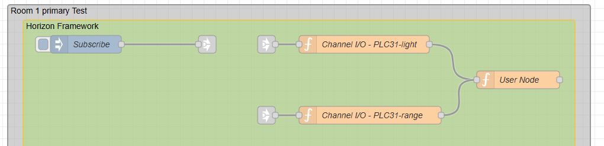

<div style = "font-family: 'Open Sans', sans-serif; font-size: 16px">

# srvProxyChannel
<div style = "color: #555">
    <p align="center">
    
    </p>
</div>

# Лицензия
////

# Описание
<div style = "color: #555">

Данная серверная служба реализует интерфейс между каналами и пространством пользователя (user space). Служба является обязательной (primary), инициализируется службой Process при старте фреймворка, и помещается в глобальную область видимости с именем *proxyCh*. Непосредственно работа интерфейса начинается с "подписки" - процесса связки объекта узла Node-RED с каналом фреймворка и указанным полем, которое будет извлекаться из пакета. Подписка осуществляется путём нажатия кнопки "Subscribe", расположенной на потоке Node-RED в виде узла Inject, который связан со всеми нодами интерфейса каналов. Если Process ещё не закончил инициализацию системы, или же инициализация завершилась с критическими ошибками, то процесс подписки не пройдёт, выдав сообщение пользователю об этом, но возможность нажать кнопку ещё раз позже остаётся. Каждый узел интерфейса может подписаться только к одному каналу раз, однако несколько узлов может подписаться к одному каналу. Это контролируется службой интерфейса. В узле вызывается метод службы интерфейса Subscribe, связывающий этот узел с каналом. В результате на выходе указанного узла будут появляться сообщения с данными с канала. Для подписки пользователю нужно передать три обязательных параметра:
```js
let opts = {
  chName: "Broker01-vl-0", // Имя канала как указано в базе данных, в виде строки
  ret: ["Value"], // Массив строк-параметров, какие данные хочет получать пользователь
  node: node // Объект текущего узла
  };
```
На данный момент пользователь может указать следующие параметры канала:

- <mark style="background-color: lightblue">Value</mark> - значение канала;
- <mark style="background-color: lightblue">Name</mark> - имя канала, как указано в БД;
- <mark style="background-color: lightblue">ChName</mark> - имя канала, как указано в конфигурации PLC;
- <mark style="background-color: lightblue">ChAlias</mark> - алиас канала;
- <mark style="background-color: lightblue">ChMeas</mark> - единица измерения канала;
- <mark style="background-color: lightblue">LowRed, LowYellow, Green, HighYellow, HighRed</mark> - алармы при переходе значений в указанные пользователем зоны.

</div>

### Конструктор
<div style = "color: #555">

Как и все службы фреймворка, конструктор srvProxyChannel принимает массив шин _busList и ссылку на объект ноды _node (см. документацию srvProcess и srvService). Служба использует три шины: sysBus, dataBus и logBus. Потписка осуществляется на два события: *all-init-stage1-set* и *all-data-fine-set*. Второе событие позволяет получать данные с каналов.
```js
const EVENT_SYSBUS_LIST = ['all-init-stage1-set'];
const EVENT_DATABUS_LIST = ['all-data-fine-set'];
const BUS_NAMES_LIST = ['sysBus', 'logBus', 'dataBus'];

this.FillEventOnList('sysBus', EVENT_SYSBUS_LIST);
this.FillEventOnList('dataBus', EVENT_DATABUS_LIST);
```
</div>

### Поля
<div style = "color: #555">

- <mark style="background-color: lightblue">#_SubChannels</mark> - приватное поле. Представляет собой массив объектов, сопоставляющий между собой имена каналов, данные и соответствующие им ноды.
</div>

### Методы
<div style = "color: #555">

- <mark style="background-color: lightblue">Subscribe(_opts)</mark> - метод, осуществляющий подписку узла Node-RED на канал, проводя также валидацию самой подписки. Принимает объект, содержащий имя канала, ссылку на объект узла, и массив параметров;
- <mark style="background-color: lightblue">HandlerEvents_all_data_fine_set()</mark> - обработчик события на шине dataBus, получает полные данные со всех каналов, находит те, на которые осуществлена подписка, и отправляет пакет с запрошенными данными на выход соответствующего узла Node-RED;
- <mark style="background-color: lightblue">Control(_opts)</mark> - метод управления каналами актуаторов, принимает имя канала и значение.
</div>

### Примеры
<div style = "color: #555">

Фрагмент кода, располагающегося в узле Node-RED, для осуществления подписки:
```js
// Получение соответствующего сообщения от узла Subscribe
if (msg.payload.dest === 'chio' && msg.payload.com === 'chio-subscribe') {
    // Опции подписки - имя канала, имя параметра, и объект данного узла
    let opts = {chName: "Broker01-vl-0", ret: ["Value"], node: node};

    // Вызов метода подписки у службы интерфейса
    global.get('proxyCh').Subscribe(opts);
}
```
Пример узлов на тестовом потоке:
<p align="left">
  
</p>

Пример кода для укправления каналом актуатора. Может быть вставлен пользователем в любой узел:
```js
// Параметры для управления актуатором
let opts = {chName: "PLC32-led", Value: 0.5};

// Вызов метода управления актуатормами у службы интерфейса
global.get('proxyCh').Control(opts);
```
<div>

# Зависимости
- srvService


</div>